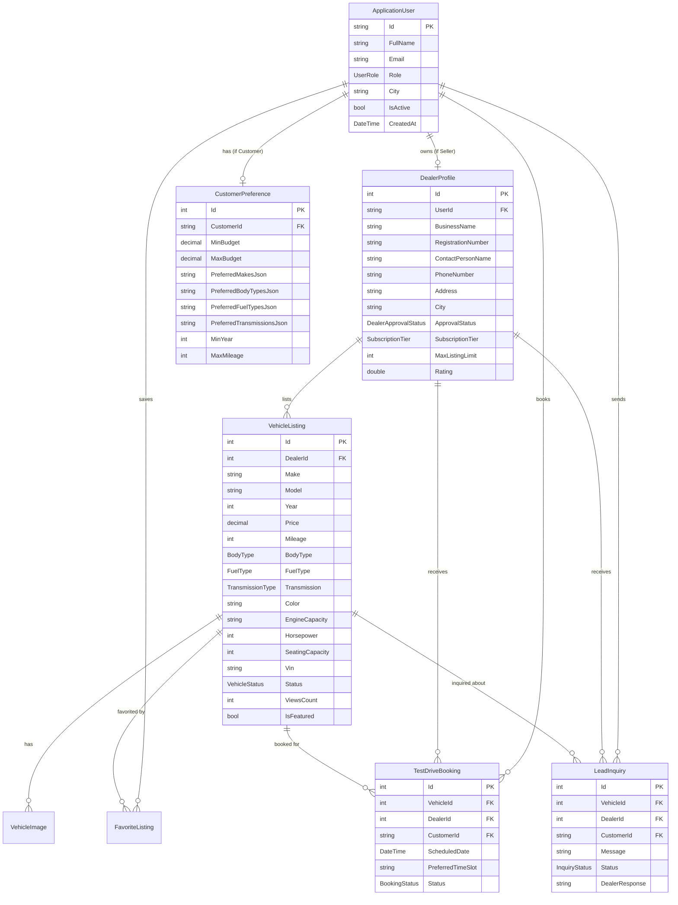
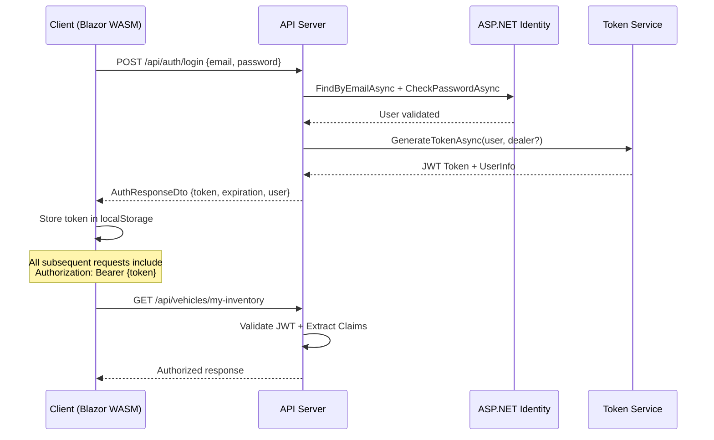

<](https://dotnet.microsoft.com/)
[](https://dotnet.microsoft.com/apps/aspnet/web-apps/blazor)
[](https://mudblazor.com/)
[](https://learn.microsoft.com/en-us/ef/core/)
[](LICENSE)

**A full-stack, production-ready SaaS automotive marketplace connecting buyers with multiple dealerships, powered by an intelligent weighted recommendation engine.**

---

[Features](#-key-features) · [Architecture](#-system-architecture) · [Quick Start](#-quick-start) · [API Reference](#-api-reference) · [Recommendation Engine](#-intelligent-recommendation-engine) · [Demo Accounts](#-demo-accounts)

</div>

---

## 📋 Table of Contents

1. [Project Overview](#-project-overview)
2. [Key Features](#-key-features)
3. [System Architecture](#-system-architecture)
4. [Technology Stack](#-technology-stack)
5. [Project Structure](#-project-structure)
6. [Domain Model](#-domain-model)
7. [Intelligent Recommendation Engine](#-intelligent-recommendation-engine)
8. [API Reference](#-api-reference)
9. [Frontend (Blazor WebAssembly)](#-frontend-blazor-webassembly)
10. [Authentication & Authorization](#-authentication--authorization)
11. [Database & Seeding](#-database--seeding)
12. [Testing](#-testing)
13. [Configuration](#-configuration)
14. [Quick Start](#-quick-start)
15. [Demo Accounts](#-demo-accounts)
16. [Deployment Guide](#-deployment-guide)

---

## 🎯 Project Overview

**AutoLink** is an enterprise-grade, multi-tenant SaaS platform that bridges the gap between automotive dealerships and car buyers. The platform offers:

- **For Customers (Free)**: Search vehicles across all dealerships, receive AI-powered recommendations via a weighted scoring algorithm, save favorites, compare up to 4 vehicles side-by-side, and request test drives.
- **For Sellers/Dealers (SaaS Subscription)**: Multi-tier subscription model (Free / Standard / Premium), vehicle inventory management with listing quotas, lead tracking & CRM inbox, test drive booking workflows (Approve / Reject / Complete), and sales analytics dashboards.
- **For Administrators**: Platform-wide oversight including dealer onboarding approvals, listing content moderation, user management directory, platform KPI metrics, and monthly recurring revenue tracking.

### Target Users

| Role | Access Model | Core Capabilities |
|:---|:---|:---|
| **Customer** | Free registration | Browse, search, AI-match, compare, favorite, book test drives, send inquiries |
| **Seller / Dealer** | SaaS subscription (Free / Standard / Premium) | Inventory CRUD, lead CRM, booking workflow, analytics, profile management |
| **Administrator** | Platform operator | Dealer verification queue, listing moderation, user directory, platform analytics |

---

## ✨ Key Features

### 🔍 Marketplace & Discovery
- **Advanced Multi-Faceted Search** — Filter by make, model, price range, body type, fuel type, transmission, year range, mileage, and dealer city
- **Smart Sort** — Sort results by date, price (asc/desc), mileage, or model year
- **Paginated Results** — Server-side pagination with configurable page sizes
- **Vehicle Detail Pages** — Full technical specifications, image gallery, dealer information, and action triggers

### 🤖 Intelligent Recommendation Engine
- **5-Variable Weighted Scoring Algorithm** — Budget (30%), Body Type (20%), Fuel & Transmission (20%), Year (15%), Mileage (15%)
- **Score Breakdown Tooltips** — Transparent scoring with per-criterion visibility
- **Decay Functions** — Smooth penalty curves for over-budget, older, or higher-mileage vehicles
- **Preferred Brand Highlight** — Priority badges for vehicles matching favorite manufacturers
- **Real-Time Preference Adjustment** — Interactive sliders with live score recalculation

### 📊 Side-by-Side Comparison
- **Compare Up to 4 Vehicles** — Tabular spec-by-spec comparison matrix
- **Visual Highlights** — Quick-glance differences across price, mileage, horsepower, seating, and features

### 📅 Test Drive Booking System
- **Date & Time Slot Selection** — Customer picks preferred appointment window
- **Dealer Workflow** — Approve → Reject → Reschedule → Complete lifecycle
- **Timeline View** — Customer dashboard with booking status history

### 📬 Lead Inquiry CRM
- **Contact Dealer** — Send inquiries about specific vehicles with contact details
- **Dealer Inbox** — Manage incoming leads with status tracking (New → Contacted → In Discussion → Closed)
- **Response Threading** — Dealer can reply directly to customer inquiries

### 💼 Dealer Management Suite
- **SaaS Tier Management** — Free (5 listings) / Standard (25 listings) / Premium (100 listings)
- **Sales Analytics** — KPI cards, monthly trends, lead conversion rates, top-performing inventory
- **Inventory Manager** — MudTable with search, status chips, and multi-step listing wizard
- **Profile Management** — Business details, logo, address, and subscription tier

### 🛡️ Platform Administration
- **Dealer Verification Queue** — Review and approve/reject new dealership applications
- **Content Moderation** — Suspend or reinstate vehicle listings with moderation notes
- **User Directory** — Platform-wide user management with role and status views
- **Revenue Dashboard** — Monthly recurring revenue (MRR), brand distribution, user growth trends

---

## 🏗 System Architecture

AutoLink follows a **Clean / Decoupled Architecture** pattern with strict layer separation:

```
┌─────────────────────────────────────────────────────────────────────────┐
│                    PRESENTATION LAYER                                  │
│  ┌──────────────────────────────┐  ┌─────────────────────────────────┐ │
│  │   AutoLink.Client (Blazor)  │  │   AutoLink.Api (REST API)       │ │
│  │   • MudBlazor UI Components │  │   • ASP.NET Core Controllers    │ │
│  │   • Pages & Layouts         │  │   • JWT Authentication          │ │
│  │   • Auth State Provider     │  │   • Swagger OpenAPI             │ │
│  │   • HTTP Service Layer      │  │   • Exception Middleware        │ │
│  └──────────────┬───────────────┘  └──────────────┬──────────────────┘ │
│                 │  HTTP/JSON (JWT)                 │                    │
├─────────────────┼─────────────────────────────────┼────────────────────┤
│                 │        APPLICATION LAYER         │                    │
│                 │  ┌──────────────────────────────┐│                    │
│                 │  │      AutoLink.Core           ││                    │
│                 │  │  • Domain Entities           ││                    │
│                 │  │  • Interface Contracts       ││                    │
│                 │  │  • Recommendation Engine     ││                    │
│                 │  └──────────────────────────────┘│                    │
├─────────────────┼──────────────────────────────────┼───────────────────┤
│                 │      INFRASTRUCTURE LAYER        │                    │
│                 │  ┌──────────────────────────────┐│                    │
│                 └──│   AutoLink.Infrastructure    │┘                    │
│                    │  • EF Core DbContext         │                     │
│                    │  • Repository Implementations│                     │
│                    │  • ASP.NET Core Identity     │                     │
│                    │  • JWT Token Service         │                     │
│                    │  • Database Seeder           │                     │
│                    └──────────────────────────────┘                     │
├─────────────────────────────────────────────────────────────────────────┤
│                       SHARED LAYER                                     │
│                 ┌──────────────────────────────────┐                    │
│                 │      AutoLink.Shared             │                    │
│                 │  • DTOs (Data Transfer Objects)  │                    │
│                 │  • Enums (Domain Enumerations)   │                    │
│                 │  • Common Models (ApiResponse)   │                    │
│                 └──────────────────────────────────┘                    │
└─────────────────────────────────────────────────────────────────────────┘
```

### Dependency Flow

```
AutoLink.Client ──→ AutoLink.Shared
AutoLink.Api ──→ AutoLink.Infrastructure ──→ AutoLink.Core ──→ AutoLink.Shared
AutoLink.Tests ──→ AutoLink.Core ──→ AutoLink.Shared
```

> **Key Design Principle**: The `AutoLink.Core` project has **zero dependency** on infrastructure or presentation concerns. All external dependencies flow inward through interface contracts defined in `AutoLink.Core.Interfaces`.

---

## 🛠 Technology Stack

### Backend
| Technology | Version | Purpose |
|:---|:---|:---|
| **.NET** | 9.0 | Runtime & SDK |
| **ASP.NET Core Web API** | 9.0 | RESTful API framework |
| **Entity Framework Core** | 9.0 | ORM & data access |
| **ASP.NET Core Identity** | 9.0 | User management & authentication |
| **JWT Bearer Authentication** | 9.0 | Stateless token-based auth |
| **Swashbuckle (Swagger)** | 6.9 | OpenAPI documentation |
| **EF Core InMemory** | 9.0 | Zero-config development database |
| **SQL Server** | — | Production database (optional) |

### Frontend
| Technology | Version | Purpose |
|:---|:---|:---|
| **Blazor WebAssembly** | 9.0 | SPA client framework |
| **MudBlazor** | 7.15 | Material Design component library |
| **System.Net.Http.Json** | 9.0 | Typed HTTP client serialization |

### Testing
| Technology | Version | Purpose |
|:---|:---|:---|
| **xUnit** | 2.9 | Unit testing framework |
| **Moq** | 4.20 | Mocking framework |

---

## 📁 Project Structure

```
AutoLink/
├── AutoLink.sln                           # Visual Studio Solution
├── README.md                              # This documentation
│
├── src/
│   ├── AutoLink.Shared/                   # Shared DTOs, Enums & Models
│   │   ├── AutoLink.Shared.csproj
│   │   ├── Enums/
│   │   │   └── Enums.cs                   # UserRole, VehicleStatus, FuelType, TransmissionType,
│   │   │                                  # BodyType, DealerApprovalStatus, SubscriptionTier,
│   │   │                                  # BookingStatus, InquiryStatus
│   │   ├── Models/
│   │   │   └── CommonModels.cs            # ApiResponse<T>, PagedResult<T>
│   │   └── DTOs/
│   │       ├── AuthDtos.cs                # LoginRequestDto, RegisterCustomerDto,
│   │       │                              # RegisterSellerDto, AuthResponseDto, UserInfoDto
│   │       ├── VehicleDtos.cs             # VehicleDto, VehicleDetailDto, CreateVehicleDto,
│   │       │                              # UpdateVehicleDto, VehicleFilterDto, VehicleComparisonDto
│   │       ├── RecommendationDtos.cs      # CustomerPreferenceDto, VehicleMatchDto, MatchBreakdownDto
│   │       ├── BookingDtos.cs             # CreateTestDriveDto, TestDriveDto, UpdateBookingStatusDto,
│   │       │                              # CreateInquiryDto, LeadInquiryDto, UpdateInquiryStatusDto
│   │       └── DealerAdminDtos.cs         # DealerProfileDto, DealerApprovalDto, ModerateListingDto,
│   │                                      # SubscriptionPlanDto, DealerAnalyticsDto, PlatformStatsDto
│   │
│   ├── AutoLink.Core/                     # Domain Entities, Interfaces & Business Logic
│   │   ├── AutoLink.Core.csproj
│   │   ├── Entities/
│   │   │   └── Entities.cs                # ApplicationUser, DealerProfile, VehicleListing,
│   │   │                                  # VehicleImage, CustomerPreference, TestDriveBooking,
│   │   │                                  # LeadInquiry, FavoriteListing, SubscriptionPlan
│   │   ├── Interfaces/
│   │   │   └── Interfaces.cs              # IVehicleRepository, IDealerRepository,
│   │   │                                  # ITestDriveRepository, IInquiryRepository,
│   │   │                                  # ICustomerPreferenceRepository, IRecommendationService,
│   │   │                                  # ITokenService, IAdminService
│   │   └── Services/
│   │       └── RecommendationService.cs   # Weighted matching algorithm implementation
│   │
│   ├── AutoLink.Infrastructure/           # Data Access, Identity & External Services
│   │   ├── AutoLink.Infrastructure.csproj
│   │   ├── Data/
│   │   │   ├── AutoLinkDbContext.cs       # EF Core context with model configuration
│   │   │   └── DbInitializer.cs           # Database seeding (roles, plans, users, vehicles)
│   │   ├── Repositories/
│   │   │   ├── VehicleRepository.cs       # Vehicle CRUD, search, favorites, pagination
│   │   │   └── AdditionalRepositories.cs  # DealerRepository, TestDriveRepository,
│   │   │                                  # InquiryRepository, CustomerPreferenceRepository
│   │   └── Services/
│   │       └── InfrastructureServices.cs  # TokenService (JWT), AdminService
│   │
│   ├── AutoLink.Api/                      # REST API (Controllers & Middleware)
│   │   ├── AutoLink.Api.csproj
│   │   ├── Program.cs                     # Application entry point & DI configuration
│   │   ├── appsettings.json               # JWT keys, connection strings, feature flags
│   │   ├── Middleware/
│   │   │   └── ExceptionMiddleware.cs     # Global error handling (RFC 7807)
│   │   └── Controllers/
│   │       ├── AuthController.cs          # POST register-customer, register-seller, login; GET me
│   │       ├── VehiclesController.cs      # GET search, GET detail, POST/PUT/PATCH/DELETE CRUD
│   │       ├── RecommendationsController.cs # GET recommendations, POST evaluate, PUT preferences
│   │       ├── TestDrivesController.cs    # POST book, GET customer/dealer bookings, PATCH status
│   │       ├── InquiriesController.cs     # POST create, GET customer/dealer inquiries, PATCH status
│   │       ├── DealersController.cs       # GET directory, GET/PUT profile, GET subscription plans
│   │       ├── AdminController.cs         # GET stats, POST approve, POST moderate, GET users
│   │       └── AnalyticsAndFavoritesControllers.cs # GET analytics, POST toggle favorites
│   │
│   └── AutoLink.Client/                   # Blazor WebAssembly Frontend
│       ├── AutoLink.Client.csproj
│       ├── Program.cs                     # WASM entry point & service registration
│       ├── App.razor                      # Root component with CascadingAuthenticationState
│       ├── _Imports.razor                 # Global using directives
│       ├── Theme/
│       │   └── AppTheme.cs               # Custom MudBlazor automotive theme palette
│       ├── Services/
│       │   ├── AuthInfrastructure.cs      # LocalStorageService, CustomAuthenticationStateProvider,
│       │   │                              # JwtInterceptor (DelegatingHandler)
│       │   └── ApiServices.cs            # AuthService, VehicleService, RecommendationService,
│       │                                 # BookingService, DealerService, AdminService,
│       │                                 # AnalyticsService, ComparisonService
│       ├── Layout/
│       │   ├── MainLayout.razor          # App shell with MudThemeProvider & dark mode toggle
│       │   └── NavMenu.razor             # Role-aware sidebar navigation
│       ├── Components/
│       │   ├── VehicleCard.razor          # Vehicle card with image, price, status, favorite toggle
│       │   ├── MatchScoreBadge.razor      # Score badge with breakdown popover
│       │   ├── ImageGallery.razor         # Image gallery with thumbnail strip
│       │   ├── TestDriveDialog.razor      # MudDialog for test drive booking
│       │   ├── InquiryDialog.razor        # MudDialog for dealer contact
│       │   ├── ListingFormDialog.razor    # Multi-step vehicle listing wizard
│       │   └── StatCard.razor            # Dashboard metric card
│       ├── Pages/
│       │   ├── Index.razor               # Landing page: hero, search bar, featured vehicles
│       │   ├── Auth/
│       │   │   ├── Login.razor           # Customer & dealer login form
│       │   │   ├── RegisterCustomer.razor # Customer registration
│       │   │   └── RegisterSeller.razor  # Dealer registration with tier selection
│       │   ├── Vehicles/
│       │   │   ├── Discovery.razor       # Advanced search with filter sidebar
│       │   │   ├── VehicleDetails.razor  # Full vehicle specification page
│       │   │   ├── SmartMatch.razor      # AI recommendation hub with preference sliders
│       │   │   └── VehicleCompare.razor  # Side-by-side comparison (up to 4 vehicles)
│       │   ├── Customer/
│       │   │   └── CustomerDashboard.razor # Garage: test drives, inquiries, favorites, preferences
│       │   ├── Seller/
│       │   │   ├── SellerDashboard.razor  # Dealer KPI analytics & sales overview
│       │   │   ├── InventoryManagement.razor # Vehicle inventory table with CRUD
│       │   │   ├── BookingManagement.razor # Test drive appointment workflow
│       │   │   ├── LeadsInbox.razor       # Customer inquiry CRM inbox
│       │   │   └── SubscriptionView.razor # SaaS tier details & upgrade trigger
│       │   └── Admin/
│       │       ├── AdminDashboard.razor   # Platform metrics, MRR, brand distribution
│       │       ├── SellerApprovals.razor  # Dealer verification queue
│       │       ├── ListingModeration.razor # Content moderation grid
│       │       └── UserManagement.razor   # Platform user directory
│       └── wwwroot/
│           ├── index.html                # SPA host page with MudBlazor CSS/JS
│           ├── appsettings.json          # Client-side API base URL config
│           └── css/
│               └── app.css              # Custom CSS overrides & animations
│
└── tests/
    └── AutoLink.Tests/                    # Unit Tests
        ├── AutoLink.Tests.csproj
        └── RecommendationEngineTests.cs   # Weighted scoring algorithm verification
```

---

## 📐 Domain Model

### Entity Relationship Diagram



### Enumeration Reference

| Enum | Values |
|:---|:---|
| `UserRole` | `Customer`, `Seller`, `Admin` |
| `VehicleStatus` | `Available`, `Reserved`, `Sold`, `UnderReview`, `Suspended` |
| `FuelType` | `Petrol`, `Diesel`, `Electric`, `Hybrid`, `PlugInHybrid`, `CNG` |
| `TransmissionType` | `Automatic`, `Manual`, `DualClutch`, `CVT` |
| `BodyType` | `Sedan`, `SUV`, `Hatchback`, `Coupe`, `Convertible`, `Wagon`, `Pickup`, `Van`, `Crossover` |
| `DealerApprovalStatus` | `Pending`, `Approved`, `Rejected`, `Suspended` |
| `SubscriptionTier` | `Free`, `Standard`, `Premium` |
| `BookingStatus` | `Requested`, `Approved`, `Rejected`, `Rescheduled`, `Completed`, `Cancelled` |
| `InquiryStatus` | `New`, `Contacted`, `InDiscussion`, `Closed` |

---

## 🤖 Intelligent Recommendation Engine

The core differentiator of AutoLink is its **weighted scoring algorithm** that intelligently matches customers to vehicles based on their stated preferences.

### Scoring Formula

$$
\text{Total Score} = S_{\text{budget}} + S_{\text{body}} + S_{\text{fuel+trans}} + S_{\text{year}} + S_{\text{mileage}}
$$

| Criterion | Weight | Max Score | Description |
|:---|:---:|:---:|:---|
| **Budget Match** | 30% | 30.0 | How well the vehicle's price fits the customer's budget range |
| **Body Type** | 20% | 20.0 | Whether the vehicle matches preferred body styles |
| **Fuel & Transmission** | 20% | 20.0 | Split: 10% fuel type match + 10% transmission match |
| **Manufacturing Year** | 15% | 15.0 | Whether the vehicle meets minimum year requirement |
| **Mileage** | 15% | 15.0 | Whether the vehicle is within maximum mileage tolerance |

### Scoring Rules Detail

#### Budget Score (30%)
| Condition | Score | Behavior |
|:---|:---|:---|
| Price within `[MinBudget, MaxBudget]` | **30.0** | Full score |
| Price below `MinBudget` | **28.0** | Bargain bonus |
| Price above `MaxBudget` | **0.0 – 30.0** | Smooth decay: `30 × (1 - excess / (MaxBudget × 0.30))` |
| No budget set | **25.0** | Neutral baseline |

#### Body Type Score (20%)
| Condition | Score |
|:---|:---|
| Vehicle body matches a preferred type | **20.0** |
| Vehicle body doesn't match | **0.0** |
| No preference set | **15.0** |

#### Fuel & Transmission Score (20% = 10% + 10%)
| Condition | Score |
|:---|:---|
| Fuel type matches | **10.0** |
| Fuel type doesn't match | **0.0** |
| No fuel preference | **7.5** |
| Transmission matches | **10.0** |
| Transmission doesn't match | **0.0** |
| No transmission preference | **7.5** |

#### Year Score (15%)
| Condition | Score |
|:---|:---|
| Vehicle year ≥ MinYear | **15.0** |
| Vehicle year < MinYear | Decay: `15 × max(0, 1 - diff × 0.25)` (reaches 0 after 4 years) |
| No year preference | Tiered: ≤3 years → 15.0, ≤7 years → 12.0, older → 8.0 |

#### Mileage Score (15%)
| Condition | Score |
|:---|:---|
| Vehicle mileage ≤ MaxMileage | **15.0** |
| Vehicle mileage > MaxMileage | Decay: `15 × max(0, 1 - excess / (MaxMileage × 0.50))` |
| No mileage preference | Tiered: <30K → 15.0, <75K → 12.0, higher → 8.0 |

### Additional Features
- **Preferred Brand Highlight** — If the vehicle's make matches `PreferredMakes`, a "Preferred Brand: {Make}" reason is prepended to match reasons
- **Human-Readable Reasons** — Each scoring criterion generates descriptive text (e.g., "Price ($65,000) is within your targeted budget")
- **Descending Rank Sort** — Results sorted by `MatchPercentage DESC`, then by `Price ASC` for tiebreaking
- **Score Clamping** — Final score is clamped to `[0.0, 100.0]` and rounded to 1 decimal place

### Example Calculation

For a **2023 Tesla Model S** priced at **$60,000** with **15,000 mi** against a customer who wants:
- Budget: $50K–$70K → **30.0** (within range)
- Body: Sedan → **20.0** (exact match)
- Fuel: Electric → **10.0** + Transmission: Automatic → **10.0** = **20.0**
- Min Year: 2022 → **15.0** (2023 ≥ 2022)
- Max Mileage: 25,000 → **15.0** (15K ≤ 25K)
- **Total: 100.0% — Perfect Match** ✅

---

## 🌐 API Reference

Base URL: `https://localhost:5001/api` (Development)

### Authentication Endpoints

| Method | Endpoint | Auth | Description |
|:---|:---|:---:|:---|
| `POST` | `/api/auth/register-customer` | ❌ | Register a new customer account |
| `POST` | `/api/auth/register-seller` | ❌ | Register a new dealership (pending admin approval) |
| `POST` | `/api/auth/login` | ❌ | Authenticate and receive JWT token |
| `GET` | `/api/auth/me` | 🔐 | Get current authenticated user profile |

### Vehicle Endpoints

| Method | Endpoint | Auth | Role | Description |
|:---|:---|:---:|:---:|:---|
| `GET` | `/api/vehicles` | ❌ | Any | Search vehicles with multi-faceted filters |
| `GET` | `/api/vehicles/{id}` | ❌ | Any | Get vehicle details (increments view count) |
| `GET` | `/api/vehicles/my-inventory` | 🔐 | Seller | Get dealer's own inventory |
| `POST` | `/api/vehicles` | 🔐 | Seller | Create a new vehicle listing |
| `PUT` | `/api/vehicles/{id}` | 🔐 | Seller | Update a vehicle listing |
| `PATCH` | `/api/vehicles/{id}/status` | 🔐 | Seller | Change vehicle status |
| `DELETE` | `/api/vehicles/{id}` | 🔐 | Seller/Admin | Delete a vehicle listing |

#### Vehicle Search Query Parameters

```
GET /api/vehicles?SearchTerm=tesla&MinPrice=30000&MaxPrice=80000&BodyType=Sedan
                 &FuelType=Electric&Transmission=Automatic&MinYear=2020
                 &MaxMileage=50000&City=Dubai&SortBy=PriceAsc
                 &PageNumber=1&PageSize=12
```

| Parameter | Type | Default | Description |
|:---|:---|:---|:---|
| `SearchTerm` | string | — | Free-text search across make, model, color |
| `Make` | string | — | Filter by manufacturer |
| `Model` | string | — | Filter by model name |
| `MinPrice` | decimal | — | Minimum price |
| `MaxPrice` | decimal | — | Maximum price |
| `MinYear` | int | — | Minimum manufacturing year |
| `MaxYear` | int | — | Maximum manufacturing year |
| `MaxMileage` | int | — | Maximum mileage |
| `BodyType` | enum | — | Filter by body style |
| `FuelType` | enum | — | Filter by fuel type |
| `Transmission` | enum | — | Filter by transmission type |
| `City` | string | — | Filter by dealer city |
| `Status` | enum | `Available` | Vehicle status filter |
| `DealerId` | int | — | Filter by specific dealer |
| `SortBy` | string | `DateDesc` | Sort: `DateDesc`, `PriceAsc`, `PriceDesc`, `MileageAsc`, `YearDesc` |
| `PageNumber` | int | `1` | Page number |
| `PageSize` | int | `12` | Results per page |

### Recommendation Endpoints

| Method | Endpoint | Auth | Description |
|:---|:---|:---:|:---|
| `GET` | `/api/recommendations` | 🔐 Customer | Get recommendations using saved preferences |
| `POST` | `/api/recommendations/evaluate` | ❌ | Evaluate recommendations with custom preferences |
| `GET` | `/api/recommendations/preferences` | 🔐 Customer | Get saved preferences |
| `PUT` | `/api/recommendations/preferences` | 🔐 Customer | Save/update customer preferences |

### Test Drive Endpoints

| Method | Endpoint | Auth | Role | Description |
|:---|:---|:---:|:---:|:---|
| `POST` | `/api/testdrives` | 🔐 | Customer | Book a test drive |
| `GET` | `/api/testdrives/my-bookings` | 🔐 | Customer | Get customer's test drives |
| `GET` | `/api/testdrives/dealer-bookings` | 🔐 | Seller | Get dealer's test drive requests |
| `PATCH` | `/api/testdrives/{id}/status` | 🔐 | Seller | Update booking status |

### Inquiry Endpoints

| Method | Endpoint | Auth | Role | Description |
|:---|:---|:---:|:---:|:---|
| `POST` | `/api/inquiries` | 🔐 | Customer | Send an inquiry about a vehicle |
| `GET` | `/api/inquiries/my-inquiries` | 🔐 | Customer | Get customer's sent inquiries |
| `GET` | `/api/inquiries/dealer-inquiries` | 🔐 | Seller | Get dealer's received inquiries |
| `PATCH` | `/api/inquiries/{id}/status` | 🔐 | Seller | Update inquiry status & respond |

### Dealer Endpoints

| Method | Endpoint | Auth | Role | Description |
|:---|:---|:---:|:---:|:---|
| `GET` | `/api/dealers` | ❌ | Any | List all approved dealers |
| `GET` | `/api/dealers/{id}` | ❌ | Any | Get dealer profile |
| `GET` | `/api/dealers/my-profile` | 🔐 | Seller | Get own dealer profile |
| `PUT` | `/api/dealers/my-profile` | 🔐 | Seller | Update own dealer profile |
| `GET` | `/api/dealers/subscription-plans` | ❌ | Any | Get available SaaS plans |

### Admin Endpoints

| Method | Endpoint | Auth | Role | Description |
|:---|:---|:---:|:---:|:---|
| `GET` | `/api/admin/stats` | 🔐 | Admin | Get platform-wide statistics |
| `GET` | `/api/admin/pending-dealers` | 🔐 | Admin | Get dealers pending approval |
| `POST` | `/api/admin/approve-dealer` | 🔐 | Admin | Approve or reject a dealer |
| `POST` | `/api/admin/moderate-listing` | 🔐 | Admin | Moderate a vehicle listing |
| `GET` | `/api/admin/users` | 🔐 | Admin | Get all platform users |

### Analytics & Favorites Endpoints

| Method | Endpoint | Auth | Role | Description |
|:---|:---|:---:|:---:|:---|
| `GET` | `/api/analytics/dealer` | 🔐 | Seller | Get dealer analytics dashboard data |
| `POST` | `/api/favorites/{vehicleId}/toggle` | 🔐 | Customer | Toggle vehicle as favorite |
| `GET` | `/api/favorites` | 🔐 | Customer | Get customer's favorited vehicles |

### API Response Format

All endpoints return a standardized `ApiResponse<T>` envelope:

```json
{
  "success": true,
  "message": "Request processed successfully",
  "data": { /* typed payload */ },
  "errors": []
}
```

Paginated responses use `PagedResult<T>`:

```json
{
  "success": true,
  "data": {
    "items": [ /* array of T */ ],
    "totalCount": 42,
    "pageNumber": 1,
    "pageSize": 12,
    "totalPages": 4
  }
}
```

---

## 🖥 Frontend (Blazor WebAssembly)

### Custom Theme

AutoLink uses a custom **MudBlazor theme** with an automotive-inspired palette:

| Token | Color | Usage |
|:---|:---|:---|
| **Primary** | Dark Slate (`#1B2838`) | App bar, navigation, primary buttons |
| **Secondary** | Electric Blue (`#00B4D8`) | Accent elements, links, highlights |
| **Tertiary** | Amber (`#FFB703`) | Warnings, featured badges, star ratings |
| **Surface** | Light Gray (`#F5F7FA`) | Page backgrounds, card surfaces |
| **AppBar** | Dark Slate (`#1B2838`) | Top navigation bar |

### Page Catalog

| Route | Page | Access | Description |
|:---|:---|:---:|:---|
| `/` | Landing | Public | Hero section, search bar, value props, featured arrivals |
| `/vehicles` | Discovery | Public | Full search interface with filter sidebar |
| `/vehicles/{id}` | Vehicle Details | Public | Spec sheet, gallery, dealer info, action dialogs |
| `/smart-match` | Smart Match | Public | AI recommendation hub with interactive sliders |
| `/compare` | Compare | Public | Side-by-side comparison for up to 4 vehicles |
| `/login` | Login | Public | Authentication form |
| `/register` | Register Customer | Public | Customer sign-up |
| `/register-seller` | Register Dealer | Public | Dealership application with tier selection |
| `/dashboard` | Customer Dashboard | 🔐 Customer | Garage: test drives, inquiries, favorites, prefs |
| `/seller/dashboard` | Seller Dashboard | 🔐 Seller | KPI analytics, sales overview |
| `/seller/inventory` | Inventory Manager | 🔐 Seller | Vehicle inventory table with CRUD |
| `/seller/bookings` | Booking Manager | 🔐 Seller | Test drive appointment workflow |
| `/seller/leads` | Leads Inbox | 🔐 Seller | Customer inquiry CRM |
| `/seller/subscription` | Subscription | 🔐 Seller | Current plan details & upgrade |
| `/admin/dashboard` | Admin Dashboard | 🔐 Admin | Platform metrics, MRR, charts |
| `/admin/approvals` | Seller Approvals | 🔐 Admin | Dealer verification queue |
| `/admin/moderation` | Listing Moderation | 🔐 Admin | Content moderation grid |
| `/admin/users` | User Management | 🔐 Admin | Platform user directory |

### Component Library

| Component | Purpose |
|:---|:---|
| `VehicleCard.razor` | Reusable vehicle card with image, price, status chip, favorite toggle, and comparison checkbox |
| `MatchScoreBadge.razor` | Circular score badge with expandable breakdown popover showing per-criterion scores |
| `ImageGallery.razor` | High-res image viewer with clickable thumbnail strip and navigation chevrons |
| `TestDriveDialog.razor` | MudDialog for selecting date, time slot, and submitting test drive bookings |
| `InquiryDialog.razor` | MudDialog for composing and sending dealer inquiries |
| `ListingFormDialog.razor` | Multi-step form wizard for creating and editing vehicle listings |
| `StatCard.razor` | Dashboard metric card with icon, value, label, and trend indicator |

### Service Layer

| Service | Responsibility |
|:---|:---|
| `AuthService` | Login, registration, JWT token management |
| `VehicleService` | Vehicle search, detail retrieval, CRUD operations |
| `RecommendationService` | Smart match preferences and scoring |
| `BookingService` | Test drive bookings and status management |
| `DealerService` | Dealer directory and profile management |
| `AdminService` | Platform administration operations |
| `AnalyticsService` | Dealer and platform analytics data |
| `ComparisonService` | Client-side vehicle comparison state management |
| `LocalStorageService` | Browser localStorage abstraction for JWT persistence |
| `CustomAuthenticationStateProvider` | JWT-based Blazor authentication state |
| `JwtInterceptor` | `DelegatingHandler` that attaches Bearer tokens to outgoing HTTP requests |

---

## 🔐 Authentication & Authorization

### Authentication Flow



### JWT Token Structure

The JWT token contains the following claims:

| Claim | Description |
|:---|:---|
| `sub` (NameIdentifier) | User's unique ID |
| `email` | User's email address |
| `name` | User's full name |
| `role` | User's role (`Customer`, `Seller`, `Admin`) |
| `DealerId` | Dealer profile ID (Seller only) |
| `SubscriptionTier` | SaaS tier (Seller only) |
| `ApprovalStatus` | Dealer approval status (Seller only) |

### Authorization Policies

| Endpoint Group | Required Role | Additional Rules |
|:---|:---|:---|
| Vehicle Search/Details | Anonymous | Public access |
| Vehicle CRUD | `Seller` | Must own the listing; dealer must be approved; listing quota enforced |
| Recommendations | `Customer` | Saved preferences per user |
| Test Drive Booking | `Customer` | Authenticated customers only |
| Test Drive Management | `Seller` | Only own dealership's bookings |
| Dealer Profile | `Seller` | Only own profile |
| Admin Operations | `Admin` | Full platform access |

---

## 🗄 Database & Seeding

### Database Providers

AutoLink supports two database configurations:

| Provider | Config Key | Use Case |
|:---|:---|:---|
| **EF Core InMemory** | `"UseInMemoryDatabase": true` | Zero-config development & demos (default) |
| **SQL Server** | `"UseInMemoryDatabase": false` | Production deployment |

> **Note**: When using InMemory mode, the database is re-seeded on every application restart. All data is volatile.

### Seed Data

The `DbInitializer.SeedAsync()` method automatically provisions:

#### Roles
- `Admin`, `Seller`, `Customer`

#### Subscription Plans

| Tier | Monthly Price | Max Listings | Priority Search | Featured Badges | Advanced Analytics | Staff Accounts |
|:---|:---:|:---:|:---:|:---:|:---:|:---:|
| **Free** | $0 | 5 | ❌ | ❌ | ❌ | ❌ |
| **Standard** | $49.99 | 25 | ✅ | ✅ | ❌ | ❌ |
| **Premium** | $149.99 | 100 | ✅ | ✅ | ✅ | ✅ |

#### Pre-Seeded Users

| Role | Email | Password | Associated Data |
|:---|:---|:---|:---|
| Admin | `admin@autolink.com` | `Admin@123` | Platform oversight |
| Seller (Standard) | `prime@motors.com` | `Seller@123` | Prime Motor Group — 6+ vehicles |
| Seller (Premium) | `apex@auto.com` | `Seller@123` | Apex Prestige Automotive — 6+ vehicles |
| Seller (Pending) | `newdealer@test.com` | `Seller@123` | Sunrise Auto Hub — pending approval |
| Seller (Free) | `eco@cars.com` | `Seller@123` | EcoDrive Motors — 2 vehicles |
| Customer | `john@example.com` | `Customer@123` | Pre-configured preferences, bookings, inquiries |

#### Pre-Seeded Vehicles (12+ Listings)

| Dealer | Vehicle | Price | Status |
|:---|:---|:---|:---|
| Prime Motor Group | 2024 Tesla Model S Plaid | $89,990 | Available |
| Prime Motor Group | 2023 BMW M4 Competition | $78,500 | Available |
| Prime Motor Group | 2024 Audi e-tron GT | $104,900 | Available |
| Apex Prestige | 2024 Porsche 911 Carrera | $115,000 | Available |
| Apex Prestige | 2024 Mercedes-AMG GT 63 | $132,500 | Available |
| Apex Prestige | 2024 Chevrolet Corvette Z06 | $115,800 | Available |
| Prime Motor Group | 2022 Toyota Camry XSE | $32,500 | Available |
| Prime Motor Group | 2023 Range Rover Sport | $83,500 | Available |
| Apex Prestige | 2024 Aston Martin DB12 | $245,000 | Reserved |
| EcoDrive Motors | 2023 Hyundai Ioniq 6 | $42,500 | Available |
| EcoDrive Motors | 2024 Tesla Model 3 | $38,990 | Available |
| *And more...* | | | |

---

## 🧪 Testing

### Unit Tests

Located in `tests/AutoLink.Tests/`, the test suite verifies the core recommendation engine:

| Test | Description | Assertion |
|:---|:---|:---|
| `CalculateMatchScore_ExactMatch_YieldsNear100Percent` | Perfect preference match produces 100% score | Budget=30, Body=20, Fuel+Trans=20, Year=15, Mileage=15 |
| `CalculateMatchScore_MismatchedBodyAndOverBudget_AppliesDecayCorrectly` | Verifies penalty curves for mismatches | Budget<30, Body=0, Year<15, Mileage<15 |
| `GetRecommendationsWithCustomPreferencesAsync_ReturnsDescendingRankedList` | Results sorted by match percentage | First result has higher score than second |

### Running Tests

```bash
# Run all tests
dotnet test

# Run with verbose output
dotnet test --verbosity detailed

# Run specific test class
dotnet test --filter "FullyQualifiedName~RecommendationEngineTests"
```

---

## ⚙ Configuration

### API Configuration (`src/AutoLink.Api/appsettings.json`)

```json
{
  "Logging": {
    "LogLevel": {
      "Default": "Information",
      "Microsoft.AspNetCore": "Warning",
      "Microsoft.EntityFrameworkCore.Database.Command": "Warning"
    }
  },
  "AllowedHosts": "*",
  "ConnectionStrings": {
    "DefaultConnection": "Server=(localdb)\\mssqllocaldb;Database=AutoLinkDb;Trusted_Connection=True;MultipleActiveResultSets=true;TrustServerCertificate=True"
  },
  "UseInMemoryDatabase": true,
  "Jwt": {
    "Key": "AutoLink_Super_Secret_Key_For_Production_2026!@#$%^...",
    "Issuer": "AutoLinkAPI",
    "Audience": "AutoLinkClient",
    "ExpiryDays": 7
  }
}
```

| Setting | Description | Default |
|:---|:---|:---|
| `UseInMemoryDatabase` | Toggle between InMemory (true) and SQL Server (false) | `true` |
| `ConnectionStrings:DefaultConnection` | SQL Server connection string (used when InMemory is false) | LocalDB |
| `Jwt:Key` | HMAC-SHA256 signing key (min 64 chars for HS512 compat) | Pre-configured |
| `Jwt:Issuer` | Token issuer claim | `AutoLinkAPI` |
| `Jwt:Audience` | Token audience claim | `AutoLinkClient` |
| `Jwt:ExpiryDays` | Token validity duration | `7` days |

### Client Configuration (`src/AutoLink.Client/wwwroot/appsettings.json`)

```json
{
  "ApiBaseUrl": "https://localhost:5001"
}
```

> **Important**: Update `ApiBaseUrl` to match your API server's address in production.

---

## 🚀 Quick Start

### Prerequisites

- [.NET 9 SDK](https://dotnet.microsoft.com/download/dotnet/9.0) installed
- Any modern web browser

### Step 1 — Clone & Restore

```bash
cd "Auto Link/Project"
dotnet restore
```

### Step 2 — Run the API Server

```bash
cd src/AutoLink.Api
dotnet run
```

The API will start at:
- **HTTPS**: `https://localhost:5001`
- **Swagger UI**: `https://localhost:5001/swagger`

### Step 3 — Run the Blazor Client

Open a **new terminal**:

```bash
cd src/AutoLink.Client
dotnet run
```

The client will start at:
- **HTTPS**: `https://localhost:5002` (or the next available port)

### Step 4 — Explore

1. Open the client URL in your browser
2. Browse the marketplace as a guest
3. Log in with one of the [demo accounts](#-demo-accounts) to explore role-specific features

---

## 🔑 Demo Accounts

| Role | Email | Password | What to Explore |
|:---|:---|:---|:---|
| 👑 **Admin** | `admin@autolink.com` | `Admin@123` | Platform stats, dealer approvals, listing moderation, user management |
| 🏢 **Seller (Standard)** | `prime@motors.com` | `Seller@123` | Inventory management, test drive bookings, leads inbox, analytics |
| 🏢 **Seller (Premium)** | `apex@auto.com` | `Seller@123` | Full dealer suite with premium features |
| 👤 **Customer** | `john@example.com` | `Customer@123` | Smart match, vehicle comparison, test drive booking, favorites |

---

## 📦 Deployment Guide

### Production Checklist

- [ ] Set `UseInMemoryDatabase` to `false` in `appsettings.json`
- [ ] Configure a production SQL Server connection string
- [ ] Replace the JWT signing key with a cryptographically secure secret
- [ ] Set `RequireHttpsMetadata` to `true` in JWT Bearer config
- [ ] Configure CORS to restrict allowed origins
- [ ] Enable HTTPS redirection
- [ ] Run EF Core migrations: `dotnet ef database update`
- [ ] Configure logging to a persistent sink (Serilog, Application Insights, etc.)
- [ ] Set environment to `Production`

### Docker (Example)

```dockerfile
# Build stage
FROM mcr.microsoft.com/dotnet/sdk:9.0 AS build
WORKDIR /src
COPY . .
RUN dotnet restore
RUN dotnet publish src/AutoLink.Api/AutoLink.Api.csproj -c Release -o /app

# Runtime stage
FROM mcr.microsoft.com/dotnet/aspnet:9.0
WORKDIR /app
COPY --from=build /app .
EXPOSE 5001
ENTRYPOINT ["dotnet", "AutoLink.Api.dll"]
```

### Environment Variables

```bash
ASPNETCORE_ENVIRONMENT=Production
ConnectionStrings__DefaultConnection="Server=your-server;Database=AutoLinkDb;..."
Jwt__Key="your-production-secret-key-min-64-characters"
UseInMemoryDatabase=false
```

---

## 📄 License

This project is developed for educational and demonstration purposes.

---

<div align="center">

**Built with ❤️ using .NET 9, Blazor WebAssembly, and MudBlazor**

</div>
]]>
